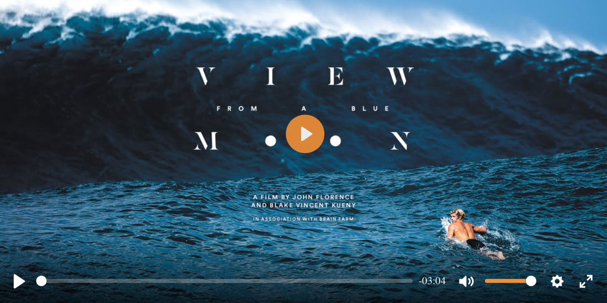
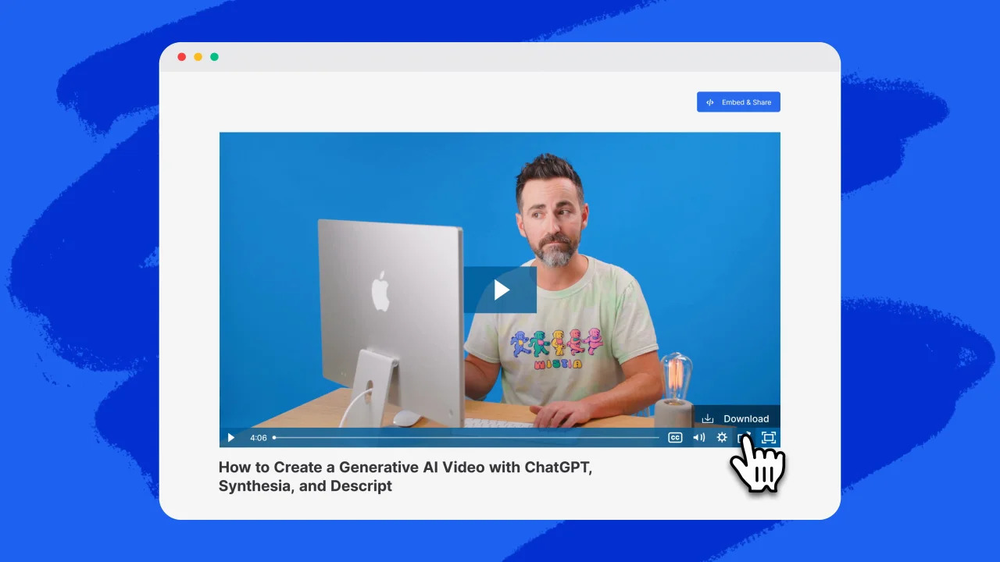

# Video Player Liferay Fragment Set

This repository provides a set of Liferay Fragments for embedding customizable video players in your Liferay site. The set currently includes two player types: **Plyr** and **Wistia**.

## Features
- Easy integration with Liferay Fragment system
- Customizable video settings for each player
- Support for popular video providers (YouTube, Vimeo, Wistia)
- Liferay event integration for advanced use cases

## Player Fragments & Configuration

### Plyr Player

**Settings:**
- **Autoplay** (`checkbox`): Start video automatically (default: false)
- **Loop Video** (`checkbox`): Repeat video playback (default: true)
- **Muted** (`checkbox`): Start video muted (default: false)
- **Video URL** (`text`): URL to the video (supports YouTube, Vimeo; default: https://vimeo.com/29912899)

### Wistia Player

**Settings:**
- **Wistia Video ID** (`text`): The Wistia video identifier (default: vgra6n0r88)
- **Autoplay** (`checkbox`): Start video automatically (default: false)
- **Play Button** (`checkbox`): Show play button if autoplay is off (default: false)
- **Muted** (`checkbox`): Start video muted (default: false)
- **Enable Custom Player Color** (`checkbox`): Enable custom color for player controls (default: false)
- **Loop Video** (`checkbox`): Repeat video playback (default: true)
- **Wistia Player Color** (`colorPicker`): Player control color (default: #111234)

## Liferay Events

### Plyr Player
- No Liferay events are dispatched or listened to in the Plyr fragment.

### Wistia Player
The Wistia fragment integrates with Liferay's event system for advanced interactions:

**Listened Events:**
- `wistia:add_to_playlist` — Adds a video to the playlist. Payload: `[videoId, options]`.
- `wistia:play` — Plays the video.
- `wistia:pause` — Pauses the video.

**Dispatched Events:**
- `wistia:ready` — Fired when the Wistia player is ready. Payload: `{ video, videoId }`.
- `wistia:video_ended` — Fired when the video ends. Payload: `{ video, videoId }`.

## Usage
1. Import the fragment to your Liferay instance.
2. Add the desired video player fragment to your page.
3. Configure the settings in the fragment sidebar to match your requirements.

---
For more details or support, please refer to the fragment source code or open an issue in this repository.

## References
- [Plyr Documentation](https://github.com/sampotts/plyr)
- [Wistia Player API Documentation](https://wistia.com/support/developers/player-api)